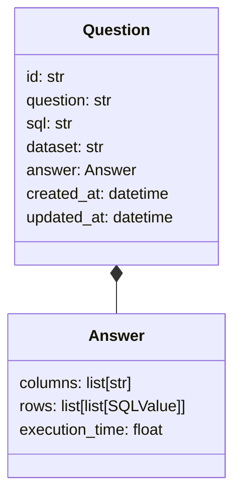

## Diagrama de classes



## Estrutura de dados

```bash
monitoria-projeto
│
├── src
│   ├── api
│   │   ├── routes
│   │   │   ├── dataset_routes.py
│   │   │   └── query_routes.py
│   │
│   ├── services
│   │   ├── dataset_service.py
│   │   └── query_service.py
│   │
│   ├── core
│   │   └── duckdb_manager.py
│   │
│   ├── schemas
│   │   └── query_schema.py
│   │
│   └── main.py
│
├── datasets
│
├── requirements.txt
```